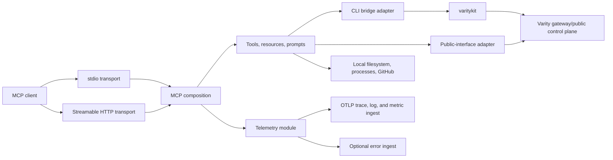

# `@varity-labs/mcp` Architecture

Status: current implementation map
Last code-grounded audit: 2026-09-01
Scope: stable ownership, interfaces, adapters, state, auth, failures, and tests

This document is the repository-level layer of Varity's progressive
architecture disclosure. `varity-engineering/architecture/likec4/` owns the
cross-repository system view (this repository is the `varity.mcp` element);
source and tests remain the detailed executable truth. Live versions and shipped
capability belong in `varity-engineering/CURRENT-STATE.md`, not here.

## Ownership

This repository owns:

- the MCP tool, resource, and prompt interface presented to AI coding clients;
- stdio full-surface and Streamable HTTP public-read transport composition;
- translation from MCP inputs to either local `varitykit` commands or the
  deploy-key-authenticated public Varity interface;
- consistent structured success/error responses;
- secret-safe, trace-correlated runtime telemetry projected through standard
  OpenTelemetry and optional Better Stack error ingestion;
- bounded local developer helpers such as build, dependency installation,
  browser opening, and development-server management.

It explicitly does not own:

- workload planning, builds performed by Varity infrastructure, provider
  selection, deployment execution, route activation, cleanup, or remediation;
- durable operation/release state, public deployment truth, credentials,
  billing ledgers, or pricing policy;
- a separate deployment engine for portal, CLI, MCP, or embedded consumers;
- direct provider, static-storage, db-proxy, credential-proxy, or billing-meter
  integration.
- Better Stack sources, error projects, dashboards, monitors, incidents, or
  deployment configuration.

## Context and call flow



All deployment paths converge on the same Varity control plane. MCP output is a
projection of downstream truth; a tool must not invent a lifecycle state that
the public interface or CLI did not return.

## Runtime modules and interfaces

| Module | Interface and invariants | Implementation / adapters | Test surface |
|---|---|---|---|
| Transport entrypoint | `--transport stdio\|http`, optional HTTP port, lifecycle and health | `src/index.ts` | direct package startup at the exact Node 22.11 LTS minimum and on Node 24, actual Node 22 container health, real-server authentication/session contract, and a credential-opaque hosted function gate; downstream owner equality remains uncertified |
| MCP composition | stdio registers the full local/deployment surface; hosted HTTP registers only authenticated `varity_search_docs` | `src/server.ts` | the real-server contract asserts the exact HTTP tool allowlist and the release gate executes one bounded public documentation result; complete stdio registration coverage is still missing |
| Tool modules | Zod-validated MCP input; structured text result; no orchestration policy | `src/tools/`, `src/resources/`, `src/prompts/` | exercise each registered tool through its result interface |
| CLI bridge | argv arrays, bounded timeout, cwd, machine-readable output, structured exit result, durable lifecycle run extraction | `src/utils/cli-bridge.ts`; `varitykit` and `python -m varitykit` adapters | `test/cli-bridge-env.mjs`, lifecycle projection tests, plus command-specific tool tests |
| Public-interface client | stdio-only deploy-key auth, 60-second GET timeout, normalized error codes/actions; never receives an HTTP OAuth bearer | `src/utils/public-api.ts`; gateway adapter | adapter tests cover gateway configuration and timeout policy plus selected response projections |
| Response module | `{success,data,message}` or MCP error `{success:false,error}` | `src/utils/responses.ts` | contract tests are currently missing |
| Credential/config lookup | environment key first, then `~/.varitykit/config.json` | `src/utils/config.ts` | precedence/redaction tests are currently missing |
| HTTP OAuth provider | proxies OAuth endpoints to `auth.varity.so`; verifies every `/mcp` bearer before the transport, rejects verification without a stable non-empty `user_id`, and binds each session to that verified principal; production verification currently targets a missing gateway route | `src/auth/provider.ts`, `src/auth/http-bearer.ts` | a real-package test proves anonymous rejection, missing-principal rejection, authenticated session continuity, cross-principal HTTP 403, and one bounded public-documentation tool result through the production verifier and tool implementations; live production verification and downstream owner equality are not certified |
| Runtime telemetry | Optional MCP server spans, correlated logs, operation-duration metrics, startup custody, and error capture; stdout and protected inputs are excluded | `src/telemetry.ts`, `src/runtime-shutdown.ts`, `src/utils/logger.ts`; OTLP and error-ingest adapters | in-memory signal correlation, synthetic OTLP transport, secret allowlist, stdout, shutdown-flush, and failed-close custody tests |
| Runtime container release | Tag `mcp-v<package-version>`; one globally locked run builds one candidate index; accepts and attests its digest; revalidates both immutable aliases; then promotes to `v<version>`, bare semver, and `latest` | `Dockerfile`, `.dockerignore`, `.github/workflows/release-container.yml`; `scripts/release-alias-gate.mjs` classifies registry absence; `scripts/validate-release-evidence.mjs` validates the complete artifact; GitHub Actions owns build/push credentials; `scripts/release-auth-fixture.mjs` supplies only an ephemeral test principal | PR CI starts the Node 22 image and validates exact health; executable tests prove auth/outage/timeout/malformed registry failures stay closed, a promotion-time recheck catches an intervening alias, evidence is exact and credential-opaque, and every promoted alias resolves to the accepted digest |

The CLI bridge and public-interface client are two real adapter seams: callers
already vary between them. Removing either adapter without migrating its
callers would spread command execution, auth, timeout, parsing, and error
complexity across tool modules, so both pass the deletion test.

## Tool routing

| Behavior | Current path | Important qualification |
|---|---|---|
| Deploy source/image | MCP tool -> CLI bridge -> `varitykit app deploy` | Requires Python and `varitykit` on the MCP host |
| Delete, env update, redeploy | MCP tool -> CLI bridge -> `varitykit app ...` | Successful acceptance projects the durable run ID; missing tracking is explicit and never presented as terminal completion |
| Template list/detail/deploy | MCP tool -> CLI bridge -> `varitykit` | Catalog truth is gateway-owned, not embedded here |
| Migration and login | MCP tool -> local process/CLI bridge | Reads or changes the MCP host's checkout/config |
| Deployment list/status | MCP tool -> public-interface adapter; optional public URL liveness probe | Liveness can downgrade a reported live state for the response; it is not durable lifecycle authority |
| Runtime logs | MCP tool -> public-interface adapter | Owner-scoped gateway response is canonical for this client |
| Cost estimate | MCP tool -> public pricing interface | Markdown and tool code must not own numeric pricing |
| Build, install, browser, dev server, create repo | Direct local process/filesystem or GitHub operations | Runs where the MCP process runs; HTTP does not imply access to the remote caller's machine |

## Transport, auth, and trust

### stdio

The MCP process normally runs on the user's machine. It can therefore operate
on an explicitly supplied local project path and reuse the user's
`~/.varitykit/config.json`. Authentication for Varity operations is the deploy
key used by `varitykit` or the public-interface adapter.

**stdout is the JSON-RPC channel and nothing else may write to it.** Every
diagnostic goes to stderr, via `src/utils/logger.ts` or `console.error`. This is
a hard invariant, not a style preference: one stray byte on stdout corrupts the
protocol stream for the client. A Winston logger whose Console transport wrote
every level, `error` included, to stdout with ANSI colour codes was removed on
2026-08-25 for exactly this reason.

### Streamable HTTP

HTTP authenticates every non-preflight `/mcp` request before it reaches the
SDK transport, attaches the verified `AuthInfo` at the SDK request interface,
requires the owning verification interface to return a stable non-empty
`user_id`, and binds each in-memory session to that verified principal. A
different verified principal receives HTTP 403 before the SDK. The HTTP
composition registers exactly one tool: `varity_search_docs`, an in-process
read of public documentation. It registers no filesystem, process, deploy-key,
customer-data, or mutation path. It creates one MCP server/transport pair per
session. Rate-limit counters and MCP sessions are process-local, so a restart
discards them and horizontal replicas require explicit shared-session/routing
design.

The code configures OAuth authorization/token/registration endpoints at
`auth.varity.so`, but `verifyAccessToken()` calls gateway
`POST /api/auth/verify`. The gateway release current at the audit has no such
route and the live endpoint returned HTTP 404 on 2026-07-18. The hosted process
and current repository also reported different versions. These facts prove
neither exact-release parity nor an authenticated protocol session. Hosted HTTP
OAuth is not end-to-end certified.

Protocol authentication does not establish downstream owner equality. Option B
therefore excludes every owner-scoped tool from hosted HTTP. The stdio-only
`public-api.ts` and `varitykit` adapters read the local MCP host environment
or `~/.varitykit/config.json`; the OAuth bearer is never propagated to either
adapter or any subprocess. Hosted HTTP must not be described as per-user
deployment authorization. Adding an owner-scoped HTTP tool requires a separate
design and exact OAuth-principal/downstream-owner equality proof.

Every filesystem, process, deployment, customer-data, and mutation tool is
stdio-only. Stdio acts on the local MCP host under the invoking user credentials.
Hosted HTTP cannot reach those adapters through MCP registration. Expanding the
HTTP allowlist is a high-risk security and interface change.

### Telemetry

Telemetry is opt-in. The OTLP adapters read standard `OTEL_EXPORTER_OTLP_*`
configuration; error capture reads `BETTERSTACK_MCP_DSN`. Missing or invalid
telemetry configuration must not change MCP transport, auth, tool, resource, or
prompt behavior. Export diagnostics remain on stderr.

`src/telemetry.ts` wraps the MCP handler-registration seam once, before tools,
resources, and prompts register. It records the OpenTelemetry MCP development
convention's low-cardinality method, transport, successful tool/prompt name,
duration, and error class. W3C `traceparent`/`tracestate` received in MCP
`params._meta` establish the server-span parent. Baggage, JSON-RPC request IDs,
session IDs, IP addresses, authorization headers, arguments, prompt variables,
resource URIs, results, and arbitrary paths are never telemetry dimensions or
log bodies. Unknown or failed target names remain absent to prevent an
attacker-controlled cardinality channel.

The logger uses an explicit safe-attribute allowlist. Failure logs separate the
observed operation (`mcp.method.name` or a bounded runtime-operation field) from
canonical `action`, which is a bounded remediation instruction. They include a
diagnostic code and one of four observed lifecycle stages (`mcp_handler`,
`http_request`, `runtime_start`, or `runtime_shutdown`), plus explicit
`unobserved` values for owner, retryability, cause, and domain when downstream
ownership cannot be proven. The optional error adapter structurally rebuilds
events from an allowlist: free-form
exception values, request/user/extra/breadcrumb data, raw paths, functions, and
source context are discarded; only a fixed exception value, safe type/frame
shape, canonical tags, and valid OpenTelemetry trace/span identifiers remain.
Each configured signal is independent: error-only and log-only configurations
still wrap the MCP handler-registration seam even without an OTLP tracer. Error
capture is strictly observational: an adapter exception emits only a fixed
secret-free diagnostic and cannot replace an MCP result or handler exception.

## State and data

The MCP owns no durable deployment or billing state.

| State | Location | Durability / scaling property |
|---|---|---|
| Deploy key/config | environment or MCP host `~/.varitykit/config.json` | host-local secret; never return or log |
| HTTP MCP sessions | `src/index.ts` in-memory map | lost on restart; not shared across replicas |
| HTTP rate-limit counters | `src/index.ts` in-memory map | lost on restart; per process/IP |
| OAuth client lookup | `src/auth/provider.ts` in-memory map | process-local; current code does not provide a durable client registry |
| Local dev-server registry | `~/.varitykit/dev-servers.json` | host-local helper state, not platform truth |
| Telemetry batches and metric aggregation | process memory in the official OpenTelemetry SDKs | bounded queues/cardinality; stdio readiness is emitted only after signal shutdown custody is installed; batches flush on stdio close, SIGTERM, SIGINT, HTTP shutdown, or fatal startup; transport-close failure cannot skip telemetry custody or report success |
| Deployment/release/log/billing truth | downstream Varity control plane | never cached as durable authority here |

Tool results and logs must not include deploy keys, OAuth tokens, registry
passwords, GitHub tokens, private environment values, or downstream internal
credentials.

Release acceptance creates one random, masked bearer inside the Actions runner.
The bearer is passed only through process environments to the ephemeral verifier
fixture and hosted function gate; it is never placed in a container environment,
image layer, command argument, artifact, or diagnostic. The fixture returns one
fixed read-only principal, has no durable state, and is not included in the
runtime container. The retained artifact is self-contained: exact digest/version
and health receipts, structured `tools/list` and real `tools/call` receipts,
gate stdout/stderr, fixture diagnostics, container diagnostics, and the final
`ACCEPTANCE PASS` receipt. Every regular evidence entry is scanned for the
bearer before upload; a missing, malformed, unreadable, or non-regular entry
fails closed.

## Failure semantics

- The CLI adapter never throws a command failure to callers; it returns stdout,
  stderr, and a normalized non-zero exit code. Tool modules translate that into
  the MCP error response.
- Lifecycle mutation tools extract only the CLI's durable run reference. They
  report accepted work as in progress and never infer terminal redeploy,
  deletion, or billing-stop completion from process exit alone.
- CLI commands have explicit bounded timeouts; deploy has a longer bounded
  window than ordinary operations. Output is capped and terminal color is
  disabled before parsing.
- The public-interface adapter aborts after 60 seconds so deploy-key-authenticated gateway
  reconciliation can finish, and preserves structured
  downstream code/message/action fields. Transport failures become
  `VARITY_API_UNREACHABLE`.
- Public URL liveness checks abort after 8 seconds. A failed probe affects the
  current response only; it does not mutate canonical deployment state.
- HTTP sessions, rate limits, and OAuth client lookup are process-local. Loss of
  process state must fail closed or require session reinitialization, never
  manufacture a successful operation.
- A healthy hosted process is not authorization proof. The exact deployed MCP,
  auth-service, and gateway releases must pass registration, authorization,
  exchange, verification, authenticated MCP request, revocation, and cleanup. A
  separately proven OAuth-principal/downstream-owner equality and an owner-bound
  operation are required before any per-user hosted operation is registered.
- A release alias is not artifact identity. The tag workflow holds one global
  non-cancelling release lock, accepts the candidate by digest, verifies exact
  health and the authenticated Option B function, attests that digest, and then
  revalidates both immutable aliases immediately before promotion. Only an
  explicit registry `manifest unknown` or `no such manifest` diagnostic proves
  absence; missing Docker/buildx/credential helpers, authentication, outage,
  timeout, empty, or malformed results fail closed. An intervening alias aborts
  promotion, and all promoted aliases must resolve back to the accepted digest.
- Tool input validation happens before adapter calls. User-controlled values
  must remain argv entries or encoded URL segments, never shell fragments.
- Telemetry initialization/export failure degrades to a bounded stderr
  diagnostic and never changes the MCP result. Export credentials remain only
  in exporter headers. Shutdown waits for buffered telemetry before exit.
- MCP error results and thrown handlers are observability failures, not proof
  that Varity or a supplier owns the underlying defect; their failure domain is
  `unobserved` until an owning adapter supplies evidence.

## Verification

Required repository checks:

```bash
npm run check:architecture
npm run build
npm test
```

Automated coverage includes CLI child-environment normalization, stderr-only
diagnostic logging and safe attributes, public URL liveness classification,
log completeness/freshness passthrough, lifecycle acceptance semantics,
public-interface endpoint/timeout policy, in-memory MCP span/log/metric
correlation, protected-input exclusion, error-only capture, structural Sentry
allowlisting, real synthetic OTLP HTTP construction, stdio shutdown flushing,
failed-close telemetry custody, package startup at the exact Node 22.11 LTS minimum and on Node 24, actual Node 22
container health, stable-principal verification, cross-principal session
rejection, exact hosted tool registration, a deterministic real-package public-
documentation tool call, the fail-closed credential-opaque release verifier
fixture, fail-closed registry absence classification, promotion-time TOCTOU
revalidation, complete credential-opaque release evidence, the digest-first
release ordering, and the separately runnable live hosted function gate.
High-value missing contract tests are
the complete stdio registration surface, public-interface auth/error
normalization, structured response shape, live production OAuth verification, and
cross-replica HTTP session behavior.
These are test gaps, not permission to create a second implementation.

## Release change evidence across the seven required metrics

- **maximum speed:** one image build feeds acceptance, attestation, and all
  aliases; the workflow does not rebuild after smoke.
- **scalability:** one repository-wide release lock and digest identity prevent
  competing tag runs without adding runtime state or a request-path dependency.
- **flexibility:** acceptance reuses the existing hosted function gate and
  production verifier interface; registry classification and evidence checking
  are separate deep modules with executable interfaces.
- **reliability:** ambiguous registry results and promotion races fail closed;
  health, version, anonymous rejection, authenticated session, exact Option B
  allowlist, and real `tools/call` must pass before promotion.
- **durability:** the accepted OCI digest is the release identity, with max
  provenance, an SBOM, GitHub attestation, and a self-contained artifact holding
  exact digest/version, health, gate, diagnostic, and PASS receipts.
- **security:** semver aliases require confirmed absence twice; the production
  verifier implementation is exercised; no filesystem, process, customer-data,
  or mutation tool becomes reachable over HTTP.
- **privacy:** the random bearer is masked and excluded from the image; every
  gate output, receipt, and diagnostic is scanned before upload, while missing,
  malformed, unreadable, or non-regular evidence fails closed.

## Change navigation

- Tool name/schema/response change: update the owning `src/tools/*` module,
  tests, public MCP documentation, and this map if the interface semantics
  changed.
- CLI command/timeout/output change: update `cli-bridge.ts` and adapter tests;
  keep command policy out of individual callers where possible.
- Public route/auth/error change: update `public-api.ts`, its contract tests,
  and the public API/docs surfaces together.
- Transport/session/OAuth change: update `index.ts`, `auth/provider.ts`,
  topology/security sections here, and add an ADR when the choice is
  load-bearing.
- Telemetry signal/attribute/export change: update `telemetry.ts`, the logger,
  correlation/transport tests, and the telemetry/security sections here. Live
  ingest configuration remains outside this repository.
- New durable state, provider logic, pricing policy, or orchestration logic:
  stop. That belongs behind the Varity control plane, not in this repository.
