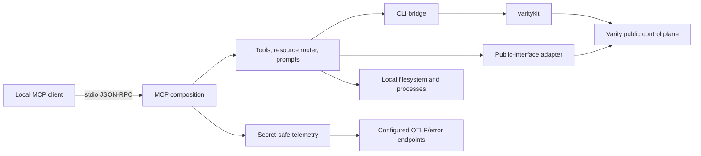

# `@varity-labs/mcp` Architecture

Status: current implementation map
Scope: stable ownership, interfaces, adapters, state, security, failures, and tests

This repository is the public stdio MCP adapter for Varity. Cross-repository
concept ownership is routed by `varity-engineering/architecture/CHANGE-IMPACT.md`;
source and tests here own the package's executable behavior. Live versions,
pricing, deployment state, and supported capability come from their executable
owners rather than copied prose.

## Ownership

This repository owns:

- the MCP tool, compatibility resource, and prompt interface presented to local
  AI coding clients;
- stdio process composition and JSON-RPC channel custody;
- translation from validated MCP inputs to either local `varitykit` commands or
  the deploy-key-authenticated public Varity interface;
- consistent structured success/error responses;
- secret-safe telemetry through standard OpenTelemetry exporters and optional
  Better Stack error ingestion;
- bounded local helpers for builds, dependencies, browser opening, development
  servers, migration, and repository creation.

It does not own:

- a hosted or self-hosted network MCP transport, OAuth service, or container
  release;
- workload planning, hosting selection, deployment execution, route activation,
  cleanup, or remediation policy;
- durable deployment/release state, credentials, billing ledgers, profile
  catalogs, pricing policy, or copied deployment guidance;
- direct provider, static-storage, database-proxy, credential-proxy, or billing
  integrations.

## Context and call flow



Every mutation reaches the same downstream control plane through `varitykit`.
MCP output is a projection of downstream truth: process exit can prove command
acceptance, but only a durable run or owner-scoped status read can prove later
lifecycle state.

## Runtime modules and interfaces

| Module | Interface and invariant | Implementation | Verification |
|---|---|---|---|
| Entrypoint | stdio only; stdout contains JSON-RPC only; unknown/retired transport flags fail closed | `src/index.ts` | `test/runtime-version.mjs`, `test/logger-stdio-channel.mjs`, runtime matrix |
| MCP composition | one complete local surface; no transport-specific alternate registration | `src/server.ts` | `test/launch-readiness-audit.mjs` plus package startup tests |
| Tools | Zod-validated input and shared structured responses; no provider or orchestration policy | `src/tools/` | per-adapter and regression tests under `test/` |
| Compatibility resource | `varity://deploy/reference` remains stable but routes mutable facts to live docs/tools | `src/resources/index.ts` | cleanup contract and architecture checks |
| CLI bridge | argv arrays, bounded timeouts/output, normalized environment, durable run-reference extraction | `src/utils/cli-bridge.ts` | `test/cli-bridge-env.mjs`, `test/lifecycle-outcomes.mjs` |
| Public-interface client | deploy-key auth, bounded GETs, normalized errors; no copied pricing or lifecycle state | `src/utils/public-api.ts` | `test/public-api-budget.mjs`, status/log tests |
| Local GitHub helper | credentials come from process environment or `gh`; clean remote URL; normal non-force push | `src/tools/create-repo.ts` | cleanup contract plus Git behavior review |
| Runtime telemetry | opt-in spans/logs/metrics/errors; protected inputs and stdout excluded | `src/telemetry.ts`, `src/runtime-shutdown.ts`, `src/utils/logger.ts` | telemetry, logger, and shutdown tests |

The CLI bridge and public-interface client are separate deep adapters because
their current callers need different downstream interfaces. Removing either
without migrating its callers would spread auth, timeout, parsing, and failure
logic into individual tools.

## Tool routing

| Behavior | Current path | Qualification |
|---|---|---|
| Deploy source/public image | MCP tool → CLI bridge → `varitykit app deploy` | Requires a working `varitykit`; its package owns interpreter requirements, while CLI/control plane own build and hosting policy |
| Delete and reapply | MCP tool → CLI bridge → `varitykit app ...` | A successful command is accepted/in progress only when a durable run is returned; otherwise outcome is unconfirmed |
| Template list/detail/deploy | MCP tool → CLI bridge → `varitykit` | Catalog, certification, hardware, and price fields are downstream-owned |
| Migration preview | temporary clone → `varitykit migrate apply --dry-run` → exact cleanup | URL-based apply/deploy fails closed until transformed-source custody is explicit |
| Deployment list/status/logs | MCP tool → public-interface adapter | Owner-scoped response is authoritative for this client |
| Cost estimate | MCP tool → public pricing/deployment interface | Profile keys, currency, billing model, and values are returned by the live owner |
| Docs search | MCP tool → public `llms-full.txt`/`llms.txt` | Five-minute process cache; stale entries are not served after expiry if refresh fails |
| Build, install, browser, dev server, repository creation | local process/filesystem adapters | Operate on the invoking user's machine and credentials |

## Transport, auth, and trust

The package has one transport: stdio. The MCP process runs under the invoking
user and may act on explicitly supplied local paths. Varity operations use the
deploy key resolved by `varitykit` or `src/utils/config.ts`.

**stdout is the JSON-RPC channel.** Diagnostics go to stderr through the
central logger or `console.error`. A single unrelated stdout byte can corrupt
the client protocol.

Hosted MCP, Streamable HTTP, OAuth proxying, sessions, request rate limits, the
runtime container, and GHCR release aliases are retired and absent. Reintroducing
a network transport is a cross-repository security/topology change, not an
alternate flag on this process.

`varity_create_repo` never accepts a credential as MCP input. It reads
`GITHUB_TOKEN`/`GH_TOKEN` or `gh auth token`, passes the credential to Git only
through ephemeral environment-backed configuration, stores a credential-free
remote, stages only the selected project path, and never force-pushes.

Telemetry is opt-in. Standard `OTEL_EXPORTER_OTLP_*` configuration controls
OTLP export and `BETTERSTACK_MCP_DSN` controls optional error capture. Telemetry
failure cannot replace a tool result or change transport behavior. Request
arguments, credentials, arbitrary paths, results, and unbounded identifiers are
excluded from telemetry attributes and error events.

## State and data

The MCP owns no durable deployment, release, pricing, or billing state.

| State | Location | Custody |
|---|---|---|
| Deploy key/config | environment or `~/.varitykit/config.json` | host-local secret; never return or log |
| GitHub credential | process environment or GitHub CLI | read for one operation; never place in MCP input, Git argv, or `.git/config` |
| Docs sections | process memory | expires after five minutes; refresh failure returns no stale authority |
| Local dev-server registry | `~/.varitykit/dev-servers.json` | host-local helper state, not platform truth |
| Telemetry buffers | process memory in OpenTelemetry SDKs | flushed on stdio close, signals, or fatal startup |
| Deployment/release/log/billing truth | downstream Varity control plane | read or mutated only through the two adapters above |

The compatibility resource contains only live-owner routes. It must not regain
copied prices, quotas, supported-stack lists, topology, availability promises,
or release state.

## Failure semantics

- CLI command failures return normalized stdout, stderr, and an exit code;
  tools convert that result into the shared MCP error shape.
- Deployment-family success means command acceptance. Tools project only a
  valid durable run reference and an explicitly reported public URL; they never
  manufacture deployment IDs, terminal status, or liveness.
- Migration is preview-only for URL input. Its `finally` cleanup removes the
  exact temporary clone on every completion/failure path; apply/deploy requests
  fail closed with the user-controlled-checkout workflow.
- The public-interface adapter aborts bounded reads and preserves downstream
  code/message/action fields. Transport failures become
  `VARITY_API_UNREACHABLE`.
- Public URL liveness probes are observations for the current status response;
  they do not mutate canonical deployment state.
- User-controlled values remain argv entries or encoded URL components, never
  shell fragments.
- Repository pushes are normal fast-forward-safe pushes. Divergence is an error
  for the user to inspect; the MCP never overwrites remote history.
- Telemetry failure emits a bounded stderr diagnostic and cannot change the MCP
  result. Shutdown retains telemetry custody even when transport close fails.

## Verification

Required checks:

```bash
npm run check:architecture
npm run build
npm test
git diff --check
```

CI runs the full build/test job on Node 22.11 and executes the built stdio
entrypoint on Node 22.11 and Node 24. The runtime test verifies the MCP
initialize response reports the exact package version and that retired network
transport arguments fail closed.

High-value coverage includes CLI environment normalization, stderr-only logging,
public URL liveness classification, log completeness/freshness, lifecycle
acceptance semantics, public-interface timeout policy, telemetry correlation and
protected-input exclusion, real synthetic OTLP construction, shutdown flushing,
and tool annotation discovery. Missing behavior should be added behind the two
existing adapters rather than through a second implementation.

## Change navigation

- Tool schema/response change: update the owning `src/tools/*` module, public
  README surface, regression tests, and this map if semantics changed.
- CLI command/timeout/output change: update `src/utils/cli-bridge.ts` and adapter
  tests; keep command policy out of individual callers.
- Public route/auth/error change: update `src/utils/public-api.ts` and its
  contract tests with the owning public API/docs surfaces.
- Resource/prompt change: preserve stable MCP names while routing mutable facts
  to live owners.
- Transport, credential custody, telemetry, durable state, pricing policy, or
  orchestration change: update this map and route cross-repository impact through
  the control repository before implementation.
