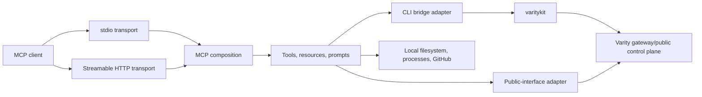

# `@varity-labs/mcp` Architecture

Scope: stable ownership, interfaces, adapters, state, auth, failures, and tests

This file owns repository-local architecture. Source and tests are the detailed
executable truth. `varity-engineering/ARCHITECTURE.md` owns cross-repository
navigation, and `varity-engineering/CURRENT-STATE.md` owns mutable deployment
and capability status.

## Ownership

This repository owns:

- the MCP tool, resource, and prompt interface presented to AI coding clients;
- stdio and Streamable HTTP transport composition;
- translation from MCP inputs to either local `varitykit` commands or the
  owner-scoped public Varity interface;
- consistent structured success/error responses;
- bounded local developer helpers such as build, dependency installation,
  browser opening, and development-server management.

It explicitly does not own:

- workload planning, builds performed by Varity infrastructure, provider
  selection, deployment execution, route activation, cleanup, or remediation;
- durable operation/release state, public deployment truth, credentials,
  billing ledgers, or pricing policy;
- a separate deployment engine for portal, CLI, MCP, or embedded consumers;
- direct provider, static-storage, db-proxy, credential-proxy, or billing-meter
  integration.

## Context and call flow



All deployment paths converge on the same Varity control plane. MCP output is a
projection of downstream truth; a tool must not invent a lifecycle state that
the public interface or CLI did not return.

## Runtime modules and interfaces

| Module | Interface and invariants | Implementation / adapters | Test surface |
|---|---|---|---|
| Transport entrypoint | `--transport stdio|http`, optional HTTP port, lifecycle and health | `src/index.ts` | process startup, HTTP protocol/session tests are currently missing |
| MCP composition | One registered tool/resource/prompt surface; local-only tools are mode-sensitive | `src/server.ts` | registration/contract tests are currently missing |
| Tool modules | Zod-validated MCP input; structured text result; no orchestration policy | `src/tools/`, `src/resources/`, `src/prompts/` | exercise each registered tool through its result interface |
| CLI bridge | argv arrays, bounded timeout, cwd, machine-readable output, structured exit result, durable lifecycle run extraction | `src/utils/cli-bridge.ts`; `varitykit` and `python -m varitykit` adapters | `test/cli-bridge-env.mjs`, lifecycle projection tests, plus command-specific tool tests |
| Public-interface client | deploy-key auth, 60-second GET timeout, normalized error codes/actions | `src/utils/public-api.ts`; gateway adapter | adapter tests cover gateway configuration and timeout policy plus selected response projections |
| Response module | `{success,data,message}` or MCP error `{success:false,error}` | `src/utils/responses.ts` | contract tests are currently missing |
| Credential/config lookup | environment key first, then `~/.varitykit/config.json` | `src/utils/config.ts` | precedence/redaction tests are currently missing |
| HTTP OAuth provider | delegates OAuth endpoints to `auth.varity.so` and token verification to the gateway | `src/auth/provider.ts` | verification and client-registration tests are currently missing; cross-repository certification is external to this repository |

The CLI bridge and public-interface client are two real adapter seams: callers
already vary between them. Removing either adapter without migrating its
callers would spread command execution, auth, timeout, parsing, and error
complexity across tool modules, so both pass the deletion test.

## Tool routing

| Behavior | Current path | Important qualification |
|---|---|---|
| Deploy source/image | MCP tool -> CLI bridge -> `varitykit app deploy` | Requires Python and `varitykit` on the MCP host |
| Delete, env update, redeploy | MCP tool -> CLI bridge -> `varitykit app ...` | Successful acceptance projects the durable run ID; missing tracking is explicit and never presented as terminal completion |
| Template list/detail/deploy | MCP tool -> CLI bridge -> `varitykit` | Catalog truth is gateway-owned, not embedded here |
| Migration and login | MCP tool -> local process/CLI bridge | Reads or changes the MCP host's checkout/config |
| Deployment list/status | MCP tool -> public-interface adapter; optional public URL liveness probe | Liveness can downgrade a reported live state for the response; it is not durable lifecycle authority |
| Runtime logs | MCP tool -> public-interface adapter | Owner-scoped gateway response is canonical for this client |
| Cost estimate | MCP tool -> public pricing interface | Markdown and tool code must not own numeric pricing |
| Build, install, browser, dev server, create repo | Direct local process/filesystem or GitHub operations | Runs where the MCP process runs; HTTP does not imply access to the remote caller's machine |

## Transport, auth, and trust

### stdio

The MCP process normally runs on the user's machine. It can therefore operate
on an explicitly supplied local project path and reuse the user's
`~/.varitykit/config.json`. Authentication for Varity operations is the deploy
key used by `varitykit` or the public-interface adapter.

### Streamable HTTP

HTTP creates one MCP server/transport pair per session and keeps it in an
in-memory map. Rate-limit counters and MCP sessions are process-local, so a
restart discards them and horizontal replicas require explicit shared-session/
routing design.

The code configures OAuth authorization, token, and registration endpoints at
`auth.varity.so`, while `verifyAccessToken()` calls gateway
`POST /api/auth/verify`. This repository cannot prove that independently
deployed services expose a compatible route set or release. Confirm that in
`varity-engineering/CURRENT-STATE.md` and with an end-to-end protocol test
before making a hosted-auth claim.

Even after protocol authentication is repaired, current tool adapters do not
receive a per-request OAuth credential. `public-api.ts` and `varitykit` instead
read the MCP host's environment or `~/.varitykit/config.json`. Therefore hosted
HTTP must not be described as per-user deployment authorization until the auth
context is explicitly propagated to tool calls and verified end to end.

Tools that read files, install dependencies, run builds, open repositories, or
spawn processes act on the HTTP server host, not the caller's workstation.
Only `open-browser` and `dev-server` are currently excluded from HTTP
registration; other local-development tools remain registered for both modes.
Treat changing that exposure as a security and interface change.

## State and data

The MCP owns no durable deployment or billing state.

| State | Location | Durability / scaling property |
|---|---|---|
| Deploy key/config | environment or MCP host `~/.varitykit/config.json` | host-local secret; never return or log |
| HTTP MCP sessions | `src/index.ts` in-memory map | lost on restart; not shared across replicas |
| HTTP rate-limit counters | `src/index.ts` in-memory map | lost on restart; per process/IP |
| OAuth client lookup | `src/auth/provider.ts` in-memory map | process-local; current code does not provide a durable client registry |
| Local dev-server registry | `~/.varitykit/dev-servers.json` | host-local helper state, not platform truth |
| Deployment/release/log/billing truth | downstream Varity control plane | never cached as durable authority here |

Tool results and logs must not include deploy keys, OAuth tokens, registry
passwords, GitHub tokens, private environment values, or downstream internal
credentials.

## Failure semantics

- The CLI adapter never throws a command failure to callers; it returns stdout,
  stderr, and a normalized non-zero exit code. Tool modules translate that into
  the MCP error response.
- Lifecycle mutation tools extract only the CLI's durable run reference. They
  report accepted work as in progress and never infer terminal redeploy,
  deletion, or billing-stop completion from process exit alone.
- CLI commands have explicit bounded timeouts; deploy has a longer bounded
  window than ordinary operations. Output is capped and terminal color is
  disabled before parsing.
- The public-interface adapter aborts after 60 seconds so owner-scoped gateway
  reconciliation can finish, and preserves structured
  downstream code/message/action fields. Transport failures become
  `VARITY_API_UNREACHABLE`.
- Public URL liveness checks abort after 8 seconds. A failed probe affects the
  current response only; it does not mutate canonical deployment state.
- HTTP sessions, rate limits, and OAuth client lookup are process-local. Loss of
  process state must fail closed or require session reinitialization, never
  manufacture a successful operation.
- A healthy hosted process is not authorization proof. The exact deployed MCP,
  auth-service, and gateway releases must pass registration, authorization,
  exchange, verification, authenticated MCP request, owner-bound operation,
  revocation, and cleanup before public hosted-auth claims are restored.
- Tool input validation happens before adapter calls. User-controlled values
  must remain argv entries or encoded URL segments, never shell fragments.

## Verification

Required repository checks:

```bash
npm run check:architecture
npm run build
npm test
```

Current automated tests cover CLI child-environment normalization and public
URL liveness classification. High-value missing contract tests are MCP tool
registration by transport, public-interface auth/error normalization,
structured response shape, HTTP OAuth/session behavior, and secret redaction.
These are test gaps, not permission to create a second implementation.

## Change navigation

- Tool name/schema/response change: update the owning `src/tools/*` module,
  tests, public MCP documentation, and this map if the interface semantics
  changed.
- CLI command/timeout/output change: update `cli-bridge.ts` and adapter tests;
  keep command policy out of individual callers where possible.
- Public route/auth/error change: update `public-api.ts`, its contract tests,
  and the public API/docs surfaces together.
- Transport/session/OAuth change: update `index.ts`, `auth/provider.ts`,
  topology/security sections here, and add an ADR when the choice is
  load-bearing.
- New durable state, provider logic, pricing policy, or orchestration logic:
  stop. That belongs behind the Varity control plane, not in this repository.
